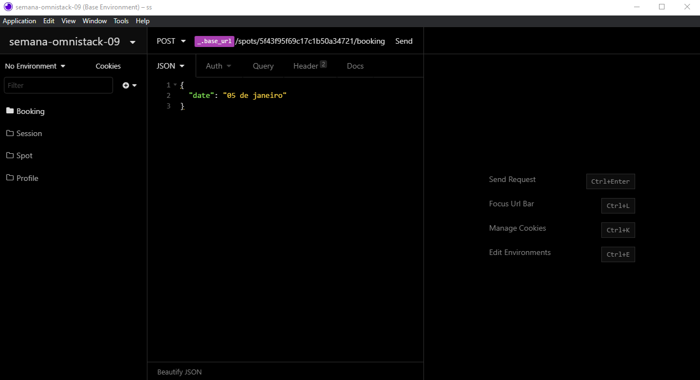

<h1 align="center">
    
</h1>

    

## :rocket: Tecnologias

Foram usadas as seguintes tecnologias:

- [Node.js](https://nodejs.org/en/)
- [React](https://reactjs.org)
- [React Native](https://reactnative.dev)
- [Expo](https://expo.io)

## :computer: Projeto

Desenvolvido durante a semana omnistack 9 pela [Rocketseat](https://rocketseat.com.br), com o objetivo de conectar empresas que querem abrir seus spots e desenvolvedores que querem um lugar para trabalhar durante um certo período.

## :thinking: Como acessar a API?

<h1 align="center">
    
</h1>

Baixo o [Insomnia](https://insomnia.rest), clique em `Application > Preferences > Data > Import Data > From URL`, e cole a seguinte url `https://github.com/erik-ferreira/semana-omnistack-9/blob/main/Insomnia_2021-02-07.json`